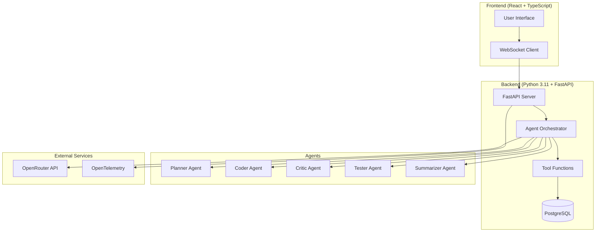

# AI Coder Agent

[](https://github.com/ai-coder-agent/ai-coder-agent/actions/workflows/ci.yml)
[](https://codecov.io/gh/ai-coder-agent/ai-coder-agent)
[](https://opensource.org/licenses/MIT)
[](https://www.python.org/downloads/)
[](https://nodejs.org/)

An autonomous AI coding agent system with multi-agent orchestration, real-time collaboration, and intelligent code generation capabilities.

## 🚀 Features

- **Multi-Agent Architecture**: Planner, Coder, Critic, Tester, and Summarizer agents
- **Real-time Collaboration**: WebSocket-based live updates and streaming
- **Intelligent Code Generation**: Context-aware code synthesis with fallback models
- **Comprehensive Tooling**: File operations, Git integration, testing, and deployment
- **Observability**: OpenTelemetry integration with metrics, logs, and traces
- **Modern UI**: React + TypeScript + Tailwind with dark theme support
- **Quality Gates**: 95%+ test coverage, linting, and security scanning

## 🏗️ Architecture



## 📋 Quick Start

### Prerequisites

- Python 3.11+
- Node.js 18+
- Docker & Docker Compose
- PostgreSQL 14+

### Development Setup

1. **Clone the repository**
   ```bash
   git clone https://github.com/ai-coder-agent/ai-coder-agent.git
   cd ai-coder-agent
   ```

2. **Environment setup**
   ```bash
   cp .env.example .env
   # Edit .env with your configuration
   ```

3. **Backend setup**
   ```bash
   cd backend
   python -m venv venv
   source venv/bin/activate  # On Windows: venv\Scripts\activate
   pip install -r requirements.txt
   ```

4. **Frontend setup**
   ```bash
   cd frontend
   npm install
   ```

5. **Database setup**
   ```bash
   docker-compose up -d postgres
   # Run migrations
   cd backend
   python -m autodev_agent.db.migrations
   ```

6. **Start development servers**
   ```bash
   # Terminal 1: Backend
   cd backend
   uvicorn autodev_agent.main:app --reload --port 8000
   
   # Terminal 2: Frontend
   cd frontend
   npm run dev
   ```

### Docker Deployment

```bash
docker-compose up -d
```

## 🧪 Testing

```bash
# Backend tests
cd backend
pytest --cov=autodev_agent --cov-report=html

# Frontend tests
cd frontend
npm test
npm run test:e2e
```

## 📚 Documentation

- [API Reference](docs/api.md)
- [Deployment Guide](docs/deployment.md)
- [Contributing Guidelines](CONTRIBUTING.md)
- [Security Policy](SECURITY.md)

## 🤝 Contributing

Please read [CONTRIBUTING.md](CONTRIBUTING.md) for details on our code of conduct and the process for submitting pull requests.

## 📄 License

This project is licensed under the MIT License - see the [LICENSE](LICENSE) file for details.

## 🙏 Acknowledgments

- OpenRouter for AI model access
- FastAPI for the web framework
- React and TypeScript for the frontend
- OpenTelemetry for observability
- All contributors and maintainers

---

**Status**: 🚧 In Development

This project is actively being developed. See [CHANGELOG.md](CHANGELOG.md) for recent updates and [TODO.md](TODO.md) for upcoming features.
