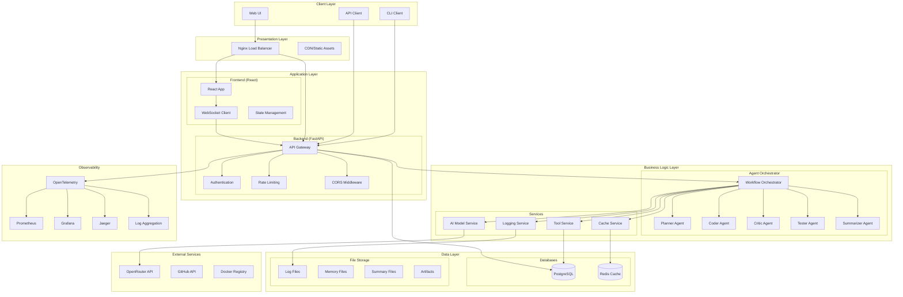
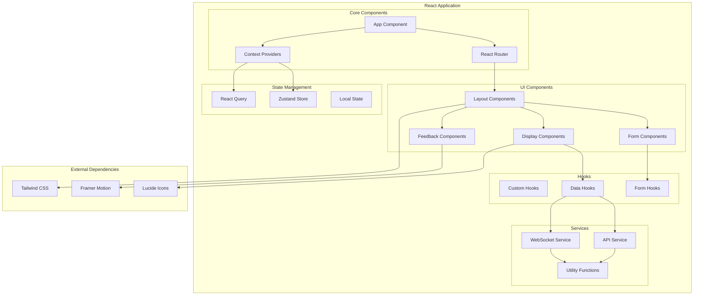
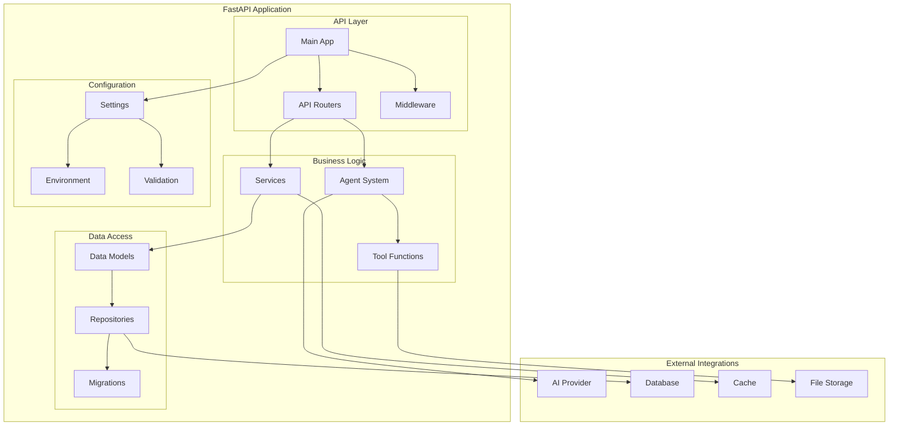
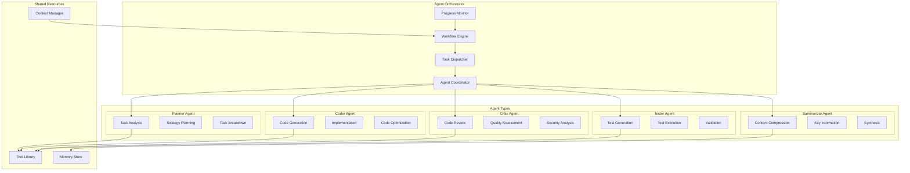
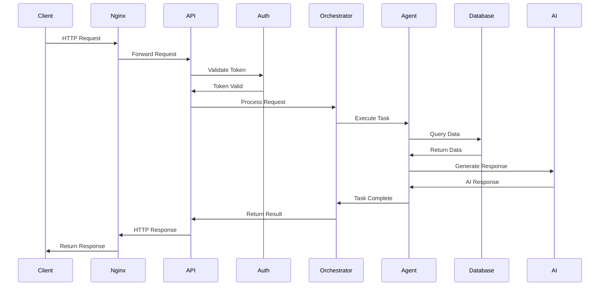
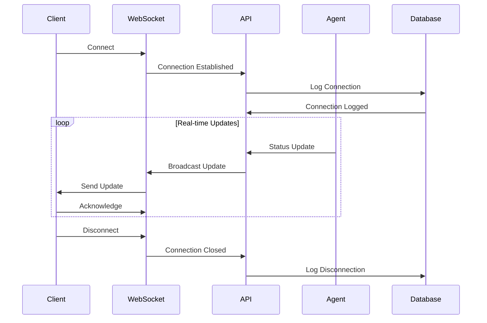
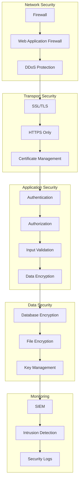
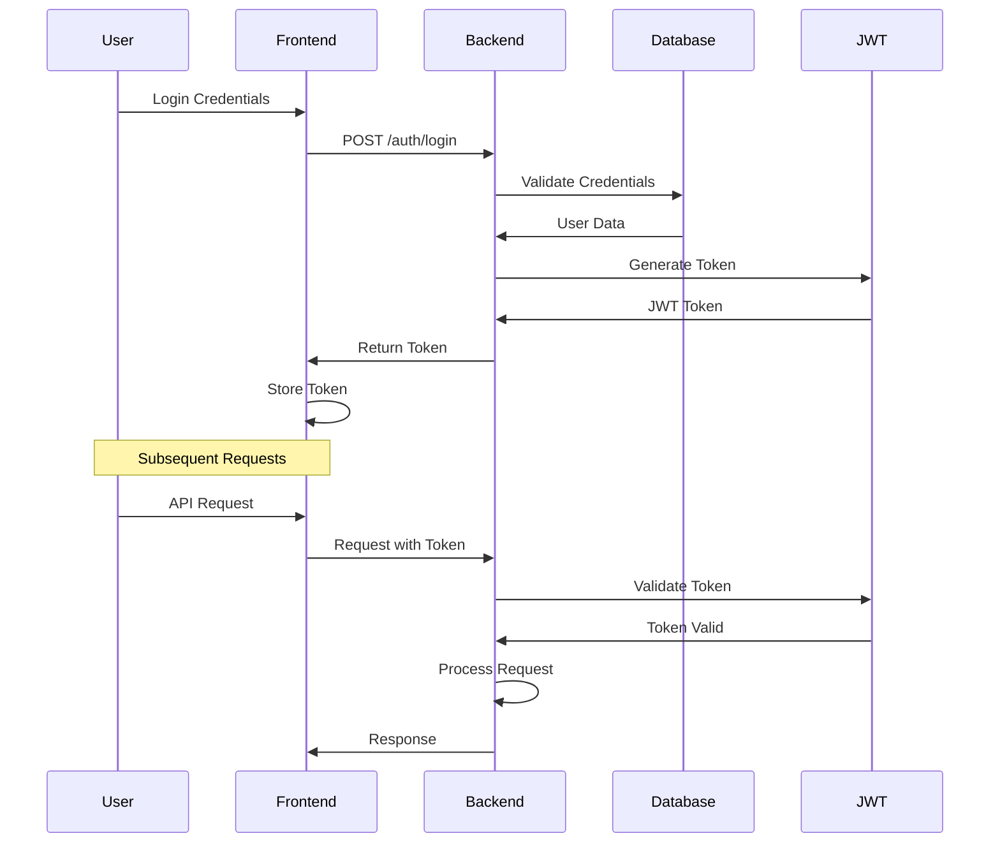
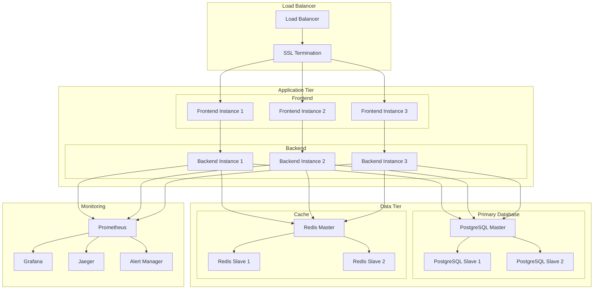
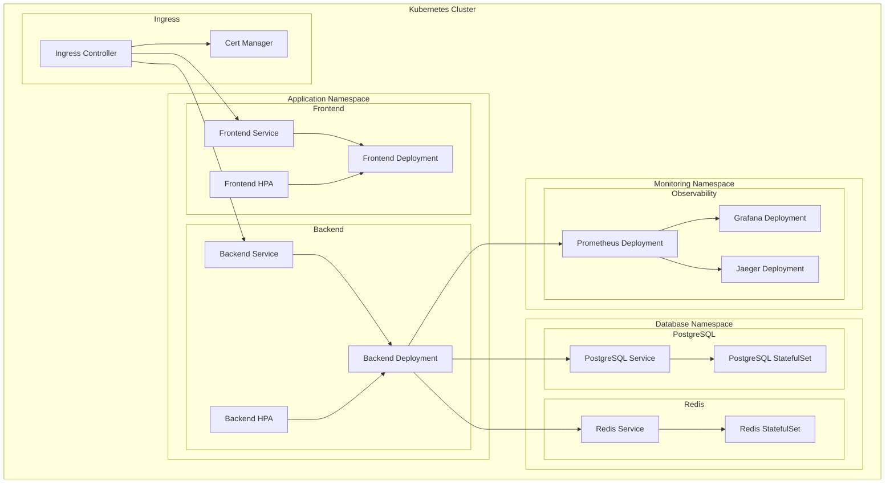

# Architecture Documentation

This document provides a comprehensive overview of the AI Coder Agent system architecture, including detailed diagrams, component descriptions, and design decisions.

## Table of Contents

- [System Overview](#system-overview)
- [High-Level Architecture](#high-level-architecture)
- [Component Architecture](#component-architecture)
- [Data Flow](#data-flow)
- [Security Architecture](#security-architecture)
- [Deployment Architecture](#deployment-architecture)
- [Technology Stack](#technology-stack)
- [Design Decisions](#design-decisions)

## System Overview

The AI Coder Agent is a comprehensive AI-powered coding system that orchestrates multiple specialized agents to handle the complete software development lifecycle, from planning to deployment.

### Key Principles

1. **Multi-Agent Orchestration**: Specialized agents work together to solve complex coding tasks
2. **Real-time Collaboration**: WebSocket-based communication for live updates
3. **Security-First**: Built-in security scanning and vulnerability detection
4. **Observability**: Comprehensive monitoring, logging, and tracing
5. **Scalability**: Horizontal scaling and load balancing support
6. **Quality Gates**: Automated testing and quality assurance

## High-Level Architecture

## Component Architecture

### Frontend Architecture

### Backend Architecture

### Agent System Architecture

## Data Flow

### Request Flow

### WebSocket Flow

## Security Architecture

### Security Layers

### Authentication Flow

## Deployment Architecture

### Production Deployment

### Kubernetes Deployment

## Technology Stack

### Backend Technologies

| Component | Technology | Version | Purpose |
|-----------|------------|---------|---------|
| **Runtime** | Python | 3.11+ | Core application runtime |
| **Framework** | FastAPI | 0.104+ | Web framework and API |
| **Database** | PostgreSQL | 15+ | Primary data storage |
| **Cache** | Redis | 7.0+ | Session and data caching |
| **ORM** | SQLAlchemy | 2.0+ | Database abstraction |
| **Migrations** | Alembic | 1.12+ | Database schema management |
| **Validation** | Pydantic | 2.5+ | Data validation and settings |
| **Authentication** | JWT | - | Token-based authentication |
| **Observability** | OpenTelemetry | 1.21+ | Metrics, logs, and traces |
| **Testing** | Pytest | 7.4+ | Unit and integration testing |
| **Linting** | Ruff | 0.1.6+ | Code linting and formatting |
| **Type Checking** | MyPy | 1.7+ | Static type checking |

### Frontend Technologies

| Component | Technology | Version | Purpose |
|-----------|------------|---------|---------|
| **Framework** | React | 18.2+ | UI framework |
| **Language** | TypeScript | 5.3+ | Type safety |
| **Styling** | Tailwind CSS | 3.3+ | Utility-first CSS |
| **Build Tool** | Vite | 5.0+ | Development and build tool |
| **Routing** | React Router | 6.20+ | Client-side routing |
| **State Management** | Zustand | 4.4+ | Global state management |
| **Server State** | React Query | 3.39+ | Server state management |
| **Forms** | React Hook Form | 7.48+ | Form handling |
| **Icons** | Lucide React | 0.294+ | Icon library |
| **Animations** | Framer Motion | 10.16+ | Animation library |
| **Testing** | Jest + RTL | 29.7+ | Unit testing |
| **E2E Testing** | Playwright | 1.40+ | End-to-end testing |

### DevOps Technologies

| Component | Technology | Version | Purpose |
|-----------|------------|---------|---------|
| **Containerization** | Docker | 20.10+ | Application containerization |
| **Orchestration** | Kubernetes | 1.24+ | Container orchestration |
| **CI/CD** | GitHub Actions | - | Continuous integration |
| **Monitoring** | Prometheus | 2.47+ | Metrics collection |
| **Visualization** | Grafana | 10.1+ | Metrics visualization |
| **Tracing** | Jaeger | 1.53+ | Distributed tracing |
| **Security** | Trivy | 0.48+ | Vulnerability scanning |
| **Code Quality** | SonarQube | 10.2+ | Code quality analysis |

## Design Decisions

### Architecture Decisions

#### 1. Multi-Agent Architecture

**Decision**: Implement a multi-agent system with specialized agents for different tasks.

**Rationale**:
- **Separation of Concerns**: Each agent has a specific responsibility
- **Scalability**: Agents can be scaled independently
- **Maintainability**: Easier to maintain and update individual agents
- **Flexibility**: Can add new agent types without affecting existing ones

**Alternatives Considered**:
- Single monolithic agent
- Microservices architecture
- Event-driven architecture

#### 2. FastAPI for Backend

**Decision**: Use FastAPI as the primary web framework.

**Rationale**:
- **Performance**: High performance with async support
- **Type Safety**: Built-in type checking with Pydantic
- **Documentation**: Automatic API documentation
- **Modern**: Modern Python features and best practices

**Alternatives Considered**:
- Django REST Framework
- Flask
- aiohttp

#### 3. React + TypeScript for Frontend

**Decision**: Use React with TypeScript for the frontend.

**Rationale**:
- **Type Safety**: Catch errors at compile time
- **Developer Experience**: Better IDE support and refactoring
- **Ecosystem**: Rich ecosystem of libraries and tools
- **Performance**: Virtual DOM and efficient rendering

**Alternatives Considered**:
- Vue.js
- Angular
- Svelte

#### 4. PostgreSQL for Database

**Decision**: Use PostgreSQL as the primary database.

**Rationale**:
- **Reliability**: ACID compliance and data integrity
- **Performance**: Excellent performance for complex queries
- **Features**: Rich feature set (JSON, full-text search, etc.)
- **Scalability**: Horizontal and vertical scaling options

**Alternatives Considered**:
- MySQL
- MongoDB
- SQLite

#### 5. Docker for Containerization

**Decision**: Use Docker for application containerization.

**Rationale**:
- **Consistency**: Same environment across development and production
- **Isolation**: Process and resource isolation
- **Portability**: Easy deployment across different environments
- **Ecosystem**: Rich ecosystem of tools and services

**Alternatives Considered**:
- Virtual machines
- Bare metal deployment
- Serverless

### Performance Considerations

#### 1. Caching Strategy

- **Redis Cache**: Session data and frequently accessed data
- **CDN**: Static assets and media files
- **Application Cache**: In-memory caching for computed results
- **Database Cache**: Query result caching

#### 2. Database Optimization

- **Connection Pooling**: Efficient database connection management
- **Indexing**: Strategic database indexing for query performance
- **Query Optimization**: Optimized SQL queries and database design
- **Read Replicas**: Horizontal scaling for read operations

#### 3. Load Balancing

- **Round Robin**: Basic load balancing for even distribution
- **Least Connections**: Dynamic load balancing based on connection count
- **Health Checks**: Automatic failover for unhealthy instances
- **Session Affinity**: Sticky sessions when required

### Security Considerations

#### 1. Authentication & Authorization

- **JWT Tokens**: Stateless authentication with secure token handling
- **Role-Based Access Control**: Granular permissions based on user roles
- **Multi-Factor Authentication**: Additional security layer (planned)
- **Session Management**: Secure session handling and timeout

#### 2. Data Protection

- **Encryption at Rest**: Database and file encryption
- **Encryption in Transit**: TLS 1.3 for all communications
- **Input Validation**: Comprehensive input sanitization
- **Output Encoding**: Protection against XSS attacks

#### 3. Security Monitoring

- **Intrusion Detection**: Automated threat detection
- **Security Logging**: Comprehensive security event logging
- **Vulnerability Scanning**: Regular security assessments
- **Incident Response**: Defined security incident procedures

### Scalability Considerations

#### 1. Horizontal Scaling

- **Stateless Design**: Application instances can be scaled horizontally
- **Load Balancing**: Distribute traffic across multiple instances
- **Database Sharding**: Horizontal database scaling (future)
- **Microservices**: Potential migration to microservices architecture

#### 2. Vertical Scaling

- **Resource Optimization**: Efficient resource utilization
- **Performance Monitoring**: Continuous performance monitoring
- **Capacity Planning**: Proactive capacity planning
- **Resource Limits**: Appropriate resource limits and requests

#### 3. Auto-scaling

- **Kubernetes HPA**: Horizontal Pod Autoscaler for automatic scaling
- **Metrics-Based Scaling**: Scale based on CPU and memory usage
- **Custom Metrics**: Business metrics for scaling decisions
- **Predictive Scaling**: Machine learning-based scaling (future)

This architecture documentation provides a comprehensive overview of the AI Coder Agent system design, implementation decisions, and technical considerations.