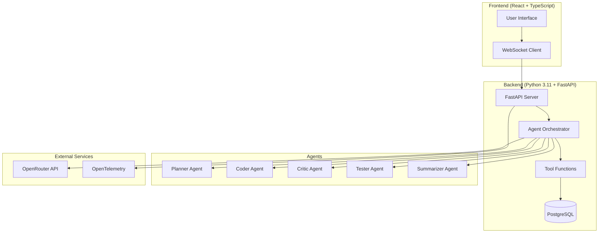

```mermaid
graph TB
    subgraph "Frontend (React + TypeScript)"
        UI[User Interface]
        WS[WebSocket Client]
    end
    
    subgraph "Backend (Python 3.11 + FastAPI)"
        API[FastAPI Server]
        AGENTS[Agent Orchestrator]
        TOOLS[Tool Functions]
        DB[(PostgreSQL)]
    end
    
    subgraph "Agents"
        PLANNER[Planner Agent]
        CODER[Coder Agent]
        CRITIC[Critic Agent]
        TESTER[Tester Agent]
        SUMMARIZER[Summarizer Agent]
    end
    
    subgraph "External Services"
        OPENROUTER[OpenRouter API]
        OTEL[OpenTelemetry]
    end
    
    UI --> WS
    WS --> API
    API --> AGENTS
    AGENTS --> PLANNER
    AGENTS --> CODER
    AGENTS --> CRITIC
    AGENTS --> TESTER
    AGENTS --> SUMMARIZER
    AGENTS --> TOOLS
    TOOLS --> DB
    AGENTS --> OPENROUTER
    API --> OTEL
```
